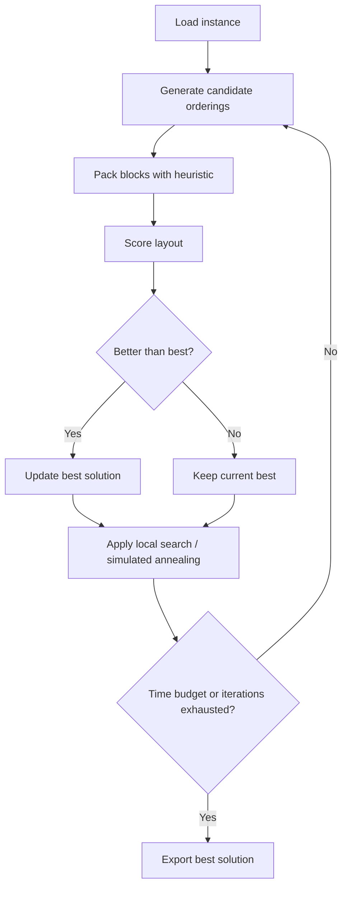
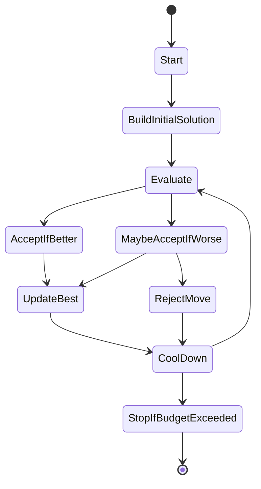
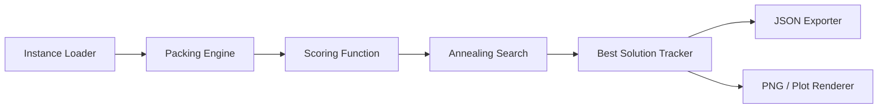
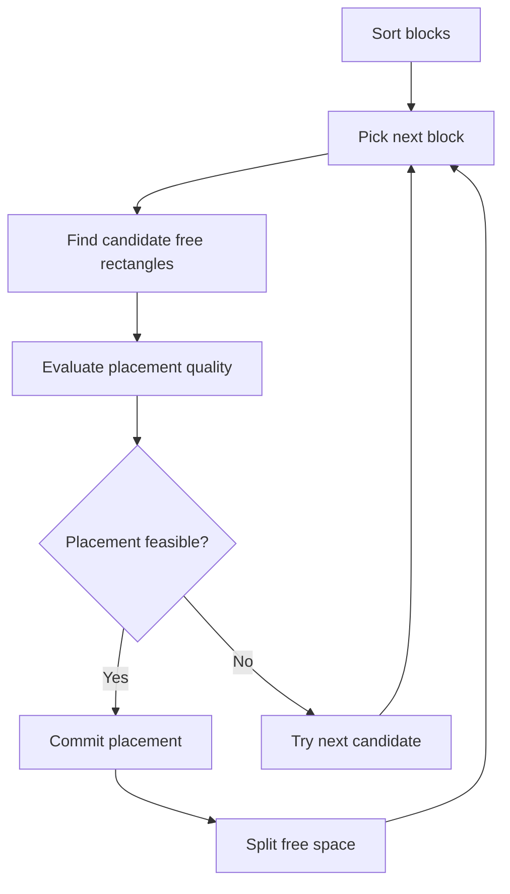
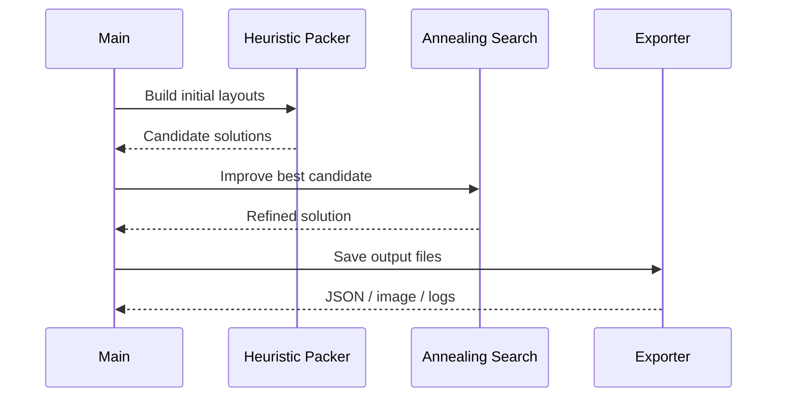
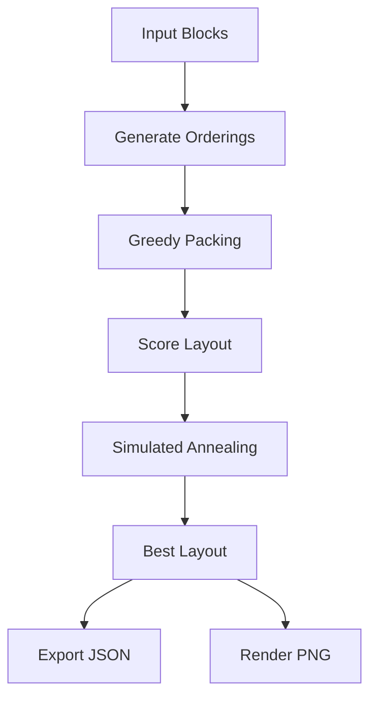

# Seri’s Choice

A heuristic optimization system for the **Grand Shipyard Puzzle** — a large-scale block packing and scheduling problem inspired by real-world shipyard logistics.

> This repository explores a practical approach to a hard combinatorial optimization task: place many blocks into a constrained workspace while respecting fit constraints, evaluating candidate layouts quickly, and improving them with local search.

---

## Table of Contents

- [Overview](#overview)
- [Problem Statement](#problem-statement)
- [Why This Problem Is Hard](#why-this-problem-is-hard)
- [Core Idea](#core-idea)
- [Repository Structure](#repository-structure)
- [How the Solver Works](#how-the-solver-works)
- [Algorithm Flow](#algorithm-flow)
- [Packing Heuristic Details](#packing-heuristic-details)
- [Candidate Ordering Strategies](#candidate-ordering-strategies)
- [Simulated Annealing Search](#simulated-annealing-search)
- [Data Model](#data-model)
- [Input / Output Format](#input--output-format)
- [Execution Steps](#execution-steps)
- [Technical Diagrams](#technical-diagrams)
- [Performance Notes](#performance-notes)
- [Design Tradeoffs](#design-tradeoffs)
- [How to Extend the Solver](#how-to-extend-the-solver)
- [Debugging and Visualization](#debugging-and-visualization)
- [Reproducibility](#reproducibility)
- [Limitations](#limitations)
- [Roadmap](#roadmap)
- [License](#license)

---

## Overview

**Seri’s Choice** is a heuristic solver designed for a shipyard-style packing challenge where the objective is to place rectangular blocks into a bounded area as efficiently as possible.

The repository follows a classic optimization pattern:

1. Read an instance.
2. Build several candidate solutions using different ordering strategies.
3. Score each layout with a packing-quality function.
4. Improve the best candidate using local search.
5. Save the best packing result and a visualization.

The solver is intentionally practical rather than exact. It is built for **speed**, **flexibility**, and **good-enough quality** on large instances where exhaustive search would be too expensive.

---

## Problem Statement

At a high level, the problem is:

- A set of rectangular blocks must be placed inside a fixed container or shipyard workspace.
- Blocks may have widths, heights, priorities, and possibly other metadata.
- Placements must not overlap.
- The solver tries to maximize packing efficiency and reduce wasted space.
- In shipyard logistics terms, the placement order also matters because operational constraints can influence feasible arrangements.

This is a combinatorial optimization problem with a huge search space. Even small changes in ordering can produce very different outcomes.

---

## Why This Problem Is Hard

Packing problems are hard because they combine:

- **Geometric constraints**: rectangles cannot overlap and must fit inside bounds.
- **Combinatorial explosion**: the number of possible placements grows rapidly.
- **Ordering sensitivity**: packing a large block early can block many later placements.
- **Multi-objective tradeoffs**: compactness, feasibility, and runtime all matter.
- **Search discontinuity**: a tiny change in the ordering can sharply change the final layout.

This makes exact optimization expensive for realistic inputs. A heuristic approach is a sensible design choice.

---

## Core Idea

The solver follows a hybrid structure:

- **Construct** several candidate packings using greedy heuristics.
- **Evaluate** each candidate by space usage / feasibility / objective score.
- **Improve** the best candidate with **simulated annealing**.
- **Repeat** until no better solution appears or the time budget is exhausted.

The underlying strategy is simple:

> Start with a strong guess, then search locally for better arrangements without paying the cost of brute force.

---

## Repository Structure

A typical structure for this project looks like:

```text
seri-s-choice/
├── main.py
├── solver.py
├── data/
│   ├── sample_input.json
│   └── ...
├── outputs/
│   ├── best_solution.json
│   ├── best_layout.png
│   └── search_log.txt
└── README.md
````

### Main files

* **`main.py`**
  Entry point. Loads the instance, calls the solver, and writes outputs.

* **`solver.py`**
  Core optimization logic: packing, scoring, perturbation, and simulated annealing.

* **`data/`**
  Example input files or benchmark instances.

* **`outputs/`**
  Saved results and optional visualizations.

---

## How the Solver Works

The solver is built around a pipeline that converts an instance into a usable layout.

### Step 1: Parse the instance

The solver reads the block list and container constraints.

### Step 2: Build several initial orderings

It tries different orderings, such as:

* by descending area
* by descending height
* by descending width
* by a mixed heuristic score

Each ordering is a different way of deciding “which block gets placed first.”

### Step 3: Pack the blocks

A packing routine places blocks one by one into the remaining free space.

### Step 4: Score the result

The layout is scored using objective terms such as:

* fit quality
* free-space fragmentation
* utilization
* penalty for infeasible placements

### Step 5: Search for improvements

The solver perturbs the ordering and repeats the packing process to find better candidates.

---

## Algorithm Flow



This design keeps the solver modular. Packing and search are separate, which makes it easier to tune either one independently.

---

## Packing Heuristic Details

The packing stage is the heart of the solver.

A greedy packer typically works like this:

1. Sort blocks according to a selected priority rule.
2. Maintain a list of free spaces.
3. For each block, choose the best free space that can accept it.
4. Split the chosen space into smaller residual spaces.
5. Continue until all blocks are placed or no feasible placement remains.

The solver’s quality depends strongly on how it chooses among candidate free spaces.

### Common scoring signals

A placement can be rated by:

* how tightly it fits the free rectangle
* how much unusable leftover space it creates
* whether it causes fragmentation
* whether it improves the global layout shape

A good packing step tries to avoid creating many small unusable gaps.

---

## Candidate Ordering Strategies

Different input orderings produce very different layouts. Seri’s Choice uses this fact rather than fighting it.

### 1. Area-descending order

Large blocks are placed first.

**Pros**

* reduces the chance that a large block gets stranded later
* often produces strong baseline layouts

**Cons**

* may create awkward leftover holes if used alone

### 2. Height-descending order

Tall blocks are prioritized.

**Pros**

* can reduce vertical fragmentation
* often helps in strip-like layouts

**Cons**

* may ignore area balance

### 3. Width-descending order

Wide blocks are prioritized.

**Pros**

* helpful when horizontal packing dominates

**Cons**

* not always good for mixed-size instances

### 4. Composite score order

A weighted score combines multiple block features.

Example idea:

```text
score = α * area + β * height + γ * width + δ * aspect_ratio_penalty
```

This is useful when raw size alone does not capture the hard parts of the instance.

---

## Simulated Annealing Search

After building an initial solution, the solver uses simulated annealing to explore nearby alternatives.

### Why simulated annealing?

Because pure greedy methods get stuck early. Annealing allows the solver to occasionally accept a worse move, which helps escape local minima.

### Neighborhood moves

Typical perturbations include:

* swapping two blocks in the order
* moving a block to a new position
* reversing a subsequence
* changing the ordering heuristic used for a restart

### Acceptance rule

If a move improves the score, accept it.

If it worsens the score, accept it with probability:

```text
P = exp(-(new_score - old_score) / temperature)
```

As the temperature decreases, the solver becomes more selective.

---

## Annealing Search Diagram



This loop is what turns a decent greedy layout into a stronger one.

---

## Data Model

A block typically has a structure like:

```python
{
    "id": 12,
    "width": 18,
    "height": 9,
    "priority": 0.73
}
```

A placement typically stores:

```python
{
    "id": 12,
    "x": 140,
    "y": 86,
    "width": 18,
    "height": 9
}
```

The solver generally keeps these conceptual entities:

* **Block**
* **Free rectangle**
* **Candidate placement**
* **Layout / solution**
* **Score / objective value**

---

## Input / Output Format

The exact format may vary depending on the benchmark instance, but the pipeline usually follows this shape.

### Input

* workspace dimensions
* block list
* optional constraints
* optional scoring metadata

### Output

* placed coordinates for each block
* final score
* optional image / plot
* search log or run summary

Example output format:

```json
{
  "score": 0.9134,
  "placements": [
    {"id": 1, "x": 0, "y": 0, "w": 12, "h": 8},
    {"id": 2, "x": 12, "y": 0, "w": 10, "h": 8}
  ]
}
```

---

## Execution Steps

A normal run looks like this:

```bash
python main.py
```

Depending on how the repository is configured, it may:

1. load a default instance,
2. generate multiple heuristic packings,
3. run a search loop,
4. export the best solution,
5. write a visualization of the final layout.

---

## Technical Diagrams

### Overall system architecture



### Packing pipeline



### Solution lifecycle



---

## Performance Notes

This is a heuristic solver, so performance is usually measured by:

* solution quality
* runtime
* stability across seeds
* sensitivity to instance size

### Strengths

* fast enough for large search spaces
* simple to tune
* easy to extend with new heuristics
* robust enough to produce valid layouts early

### Weaknesses

* not guaranteed optimal
* can be sensitive to parameter settings
* local search may still miss hard rearrangements

---

## Design Tradeoffs

The solver chooses practicality over exactness.

### Why not exact search?

Because exact optimization becomes too slow as the number of blocks grows.

### Why not pure machine learning?

Because packing constraints are rigid, and deterministic geometric logic is still very effective.

### Why hybrid heuristics?

Because they combine the best of both worlds:

* greedy methods give a valid starting point
* local search improves the starting point
* the search is cheap enough to run repeatedly

---

## How to Extend the Solver

This repository is easy to adapt.

### Add a new ordering rule

Create a new block sort key and try it during initialization.

### Add a new neighborhood move

Examples:

* block swap
* block relocation
* heuristic restarts
* partial repacking of a subregion

### Add a different objective

You could optimize for:

* minimum wasted space
* minimum height
* minimum fragmentation
* maximum utilization
* weighted priority satisfaction

### Add constraints

Possible additions include:

* rotation restrictions
* stability rules
* precedence constraints
* fixed anchor positions
* blocked regions

---

## Debugging and Visualization

Visual output is important for packing solvers.

### Common debugging tools

* draw each block with a unique color
* label each block with its ID
* highlight unused space
* log rejected placements
* compare candidate layouts side by side

### What to look for

* large holes created early
* blocks that could have fit better in another position
* unexpected fragmentation
* unstable improvements during search

A good visualization often reveals why a heuristic is underperforming.

---

## Reproducibility

To make experiments reproducible:

* fix random seeds
* log every heuristic parameter
* save the input instance
* record the final packing order
* store the score after each iteration

A reproducible solver is easier to debug and much easier to compare against alternative approaches.

---

## Limitations

This approach is practical, but it has limits:

* It may miss globally optimal layouts.
* It may struggle on adversarial instances.
* It depends on the quality of the initial heuristic seeds.
* It may require tuning when the instance distribution changes.
* Search performance can plateau if the neighborhood is too small.

These are standard tradeoffs in heuristic optimization.

---

## Roadmap

Possible future improvements:

1. Add stronger free-space selection rules.
2. Introduce adaptive heuristic weighting.
3. Use tabu memory to avoid repeated states.
4. Add multi-start search with different seeds.
5. Try adaptive annealing schedules.
6. Combine greedy packing with large-neighborhood repair.
7. Add benchmark logging and automatic comparison plots.

---

## License

Add the license that matches the repository policy before publishing.

---

## Closing Notes

**Seri’s Choice** is built around a simple optimization philosophy:

> Use fast geometric heuristics to build a valid solution, then search intelligently for better ones.

That makes it well suited for shipyard-style packing problems where time is limited and the instance space is too large for brute force.

---

## Appendix: Example Mermaid Diagram for the README



## Appendix: Example Solver Pseudocode

```python
def solve(instance):
    seeds = build_initial_orderings(instance.blocks)
    best = None

    for ordering in seeds:
        candidate = pack(instance, ordering)
        if best is None or score(candidate) > score(best):
            best = candidate

    best = anneal(instance, best)
    return best
```

## Appendix: Example Packing Pseudocode

```python
def pack(instance, ordering):
    free_rects = [instance.workspace]
    placements = []

    for block in ordering:
        chosen = select_best_free_rectangle(block, free_rects)
        if chosen is None:
            continue

        placement = place_block(block, chosen)
        placements.append(placement)
        free_rects = split_free_space(free_rects, placement)

    return placements
```

```
```
